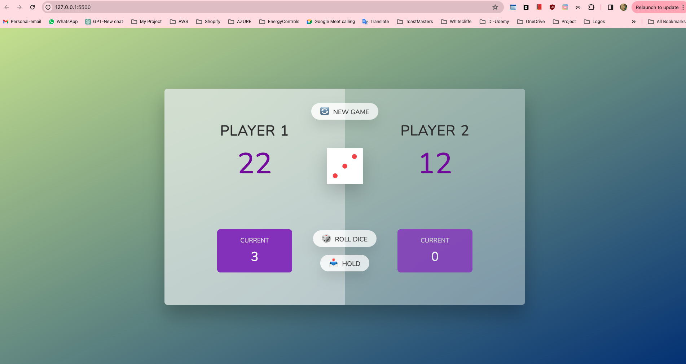
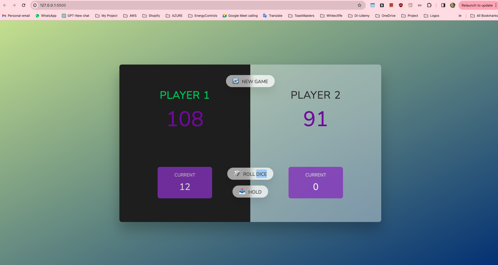

# Pig Game

Pig is a simple dice game.

Each turn, a player repeatedly rolls a dice until either a 1 is rolled or the player decides to "hold":

If the player rolls a 1, they score nothing and it becomes the next player's turn.
If the player rolls any other number, it is added to their turn total and the player's turn continues.
If a player chooses to "hold", their turn total is added to their score, and it becomes the next player's turn.

[Visit Pig Game](https://mariaale2023.github.io/Pig-Game-Ale/)

# GAME RULES

- The game has 2 players, playing in rounds
- In each turn, a player rolls a dice as many times as he whishes. Each result get added to his ROUND score
- BUT, if the player rolls a 1, all his ROUND score gets lost. After that, it's the next player's turn
- The player can choose to 'Hold', which means that his ROUND score gets added to his GLBAL score. After that, it's the next player's turn
- The first player to reach 100 points on GLOBAL score wins the game
  
